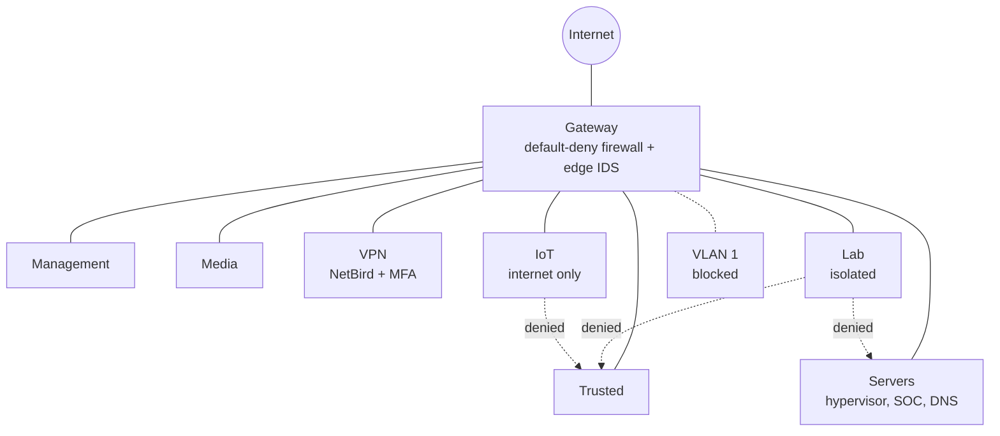

# Home Lab

My personal security and automation lab. I use it to practice pentesting, network hardening, detection, and self-hosting, and to run local AI without sending anything to the cloud.

It's a learning environment — nothing here touches my employer's systems or data. I don't publish IPs, ports, config files, or hardware makes and models either; the details below are intentionally high-level, the same least-disclosure habit I'd apply to a production environment.

> **Want to build your own?** See the [Build Guide](BUILD-GUIDE.md): a step-by-step walkthrough of this lab, organized around the CIA triad.

---

## Contents

- [Network](#network)
- [Detection Stack](#detection-stack)
- [Hardware & Services](#hardware--services)
- [How the SOC Was Built](#how-the-soc-was-built)
- [Pentesting](#pentesting)
- [Security+ in Practice](#security-in-practice)
- [About](#about)

---

## Network

Everything's split into VLANs with a default-deny firewall. A segment only gets the access it actually needs, and the rest is blocked. There are 8 VLANs in total: 7 active segments plus the default VLAN 1, which is kept as a locked-down dead end.

| VLAN | What's on it |
|------|--------------|
| Management | Device and infrastructure admin |
| Trusted | My main personal devices |
| Servers | Hypervisor, NAS, DNS, monitoring, core services |
| Lab | Pentesting targets — isolated |
| IoT | Smart-home gear, internet-only |
| Media | Streaming devices |
| VPN | Remote-access clients |
| Default (VLAN 1) | Nothing. Blocked from all internal subnets |

A few choices worth calling out:

- The **Lab** can't reach my trusted or server networks. If I pop a box during testing, it stays contained.
- **IoT** devices get internet and nothing else. No talking to my real machines.
- Both Lab and IoT have their own WiFi SSIDs, so the separation holds at the wireless layer too, not just on the wire.
- The default **VLAN 1** (the "everything lands here if misconfigured" trap) is blocked from all internal subnets.

This maps cleanly to the **CIA triad**:

| | How the lab covers it |
|---|---|
| **Confidentiality** | VLAN segmentation, default-deny firewall, NetBird remote access with MFA and per-device policies, no public configs |
| **Integrity** | Suricata IDS at the edge, Security Onion on the inside, Wazuh file integrity monitoring, Pi-hole DNS filtering, ZFS checksums and snapshots |
| **Availability** | RAIDZ2 two-drive fault tolerance, off-array backups, services spread across separate hardware |

---

## Detection Stack

Three layers, each covering what the one before it can't:

| Layer | Platform | What it covers |
|-------|----------|----------------|
| Edge | **Suricata** on the gateway | North-south traffic (internet in and out). Blocks or alerts on known-bad signatures before anything reaches the internal network |
| Network (NSM) | **Security Onion** on the hypervisor — Suricata + Zeek + Elastic | East-west traffic between VMs via a port mirror: signature alerts (Suricata), full connection metadata (Zeek), and a searchable dashboard (Elastic) |
| Host (HIDS) | **Wazuh** server on a dedicated node, agents on the VMs and PCs | File changes, logins, process execution, and privilege escalation inside each machine |

**Why three layers?** The edge IDS is an appliance: it can block or alert, but it can't see traffic between internal VMs and doesn't give me deep forensics. Security Onion watches the wire on the inside — it sees the scan, the protocol behavior, the file transfer. Wazuh watches inside the machines — it sees what actually happened on the host after the packet landed. Network visibility tells you someone knocked; host visibility tells you whether they got in and what they touched. Together they cover the full path of an attack, from the first packet to a changed file on a server.

---

## Hardware & Services

Makes and models are intentionally left out. What matters is the role each piece plays.

**Hypervisor host** — quad-core with 64GB RAM, running Proxmox VE: Ubuntu for services and testing, Parrot OS for the security toolkit, the Lab targets, and the Security Onion sensor. Storage is a 4-drive **ZFS RAIDZ2** pool (~2TB usable, any two drives can fail, snapshots on) with a separate off-array backup target.

**Security node** — a single-board computer with NVMe storage running the Wazuh server and dashboard. Kept off the hypervisor so host monitoring keeps running even if the hypervisor goes down.

**VPN node** — a dedicated single-board computer running self-hosted NetBird. Remote access is tied to identity with MFA and per-device access policies, not just a shared key.

**Home automation node** — Home Assistant on its own single-board computer, kept apart from the security gear.

**DNS filtering** — Pi-hole for network-wide DNS filtering.

**AI inference node** — a dedicated machine running local LLMs, kept entirely off the cloud.

**Networking** — a prosumer gateway/firewall with a built-in IDS, plus Wi-Fi 6 access points, custom firewall policies, and the VLAN setup above.

---

## How the SOC Was Built

Built in phases on purpose — the whole point is to learn each integration as I go, not deploy a black box.

| # | Phase | Status |
|---|-------|--------|
| 1 | Deploy Security Onion on the hypervisor (management + sniffing interfaces); confirm Suricata + Zeek + Elastic are pulling traffic | ✅ |
| 2 | Configure a port mirror so the sensor sees east-west traffic between VMs | ✅ |
| 3 | Stand up the Wazuh server on a dedicated node and roll out agents to the VMs and PCs | ✅ |
| 4 | Replace key-only VPN access with self-hosted NetBird and MFA | ✅ |
| 5 | Run a simulated attack from an isolated Lab VM and confirm it shows up end to end | ⬜ Next |

---

## Pentesting

Closed lab, vulnerable VMs as targets, nothing leaves the network. Mostly Nmap, Metasploit, Burp Suite, and Wireshark, plus whatever else ships with Parrot. Attacks from the Lab will also serve as the end-to-end test for the detection stack (phase 5 above).

---

## Security+ in Practice

The lab is where I practice the CompTIA Security+ (SY0-701) material hands-on instead of just reading it:

| Domain | Where it shows up in the lab |
|--------|------------------------------|
| General Security Concepts | CIA triad design, least privilege between segments, MFA and Zero Trust remote access |
| Threats, Vulnerabilities, and Mitigations | Closed-lab pentesting, isolated Lab VLAN to contain compromised targets |
| Security Architecture | VLAN segmentation, default-deny firewall, RAIDZ2 storage and off-array backups |
| Security Operations | Layered detection (edge IDS, Security Onion, Wazuh), file integrity monitoring, centralized alerting |

---

## About

I'm an IT System Administrator with an AAS in Cybersecurity from Dallas College. Find me on [LinkedIn](https://www.linkedin.com/in/noevalencia).

<!-- you read the source. respect. there's a little more in /.well-known/ -->
